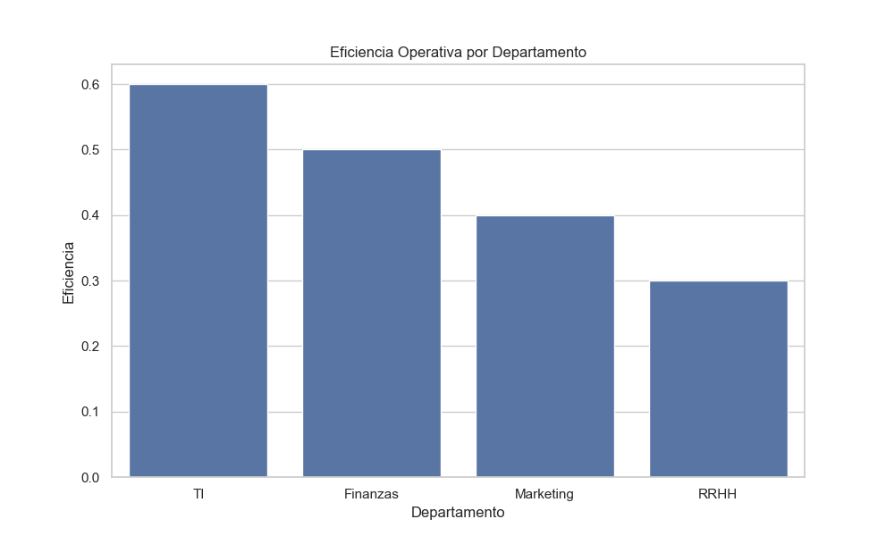
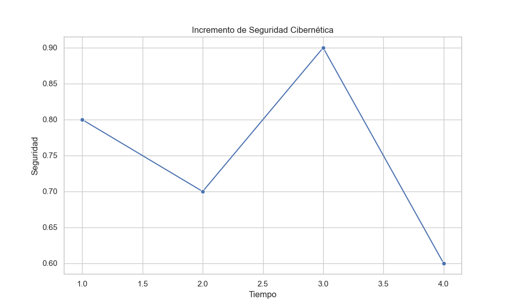
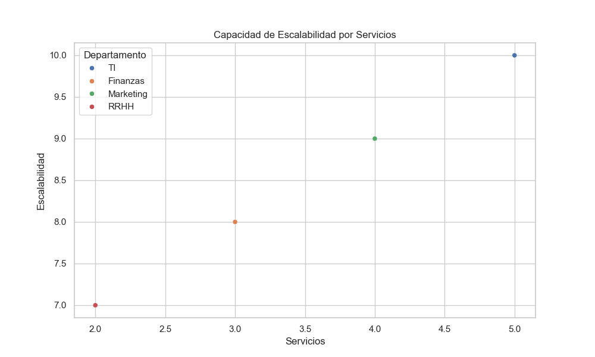

# Análisis Gráfico del Impacto

Este documento contiene los análisis gráficos generados durante la implementación de la infraestructura convergente en TechSolutions Inc.

---

## 1. Eficiencia Operativa
### Gráfico: Incremento en la Utilización del Hardware
- **Descripción**: Este gráfico muestra la mejora en la utilización del hardware después de implementar tecnologías de virtualización y almacenamiento centralizado.
- **Datos Clave**:
  - Utilización previa: 45%
  - Utilización posterior: 90%
- **Gráfico Generado**: 

---

## 2. Seguridad Cibernética
### Gráfico: Incremento en Medidas de Seguridad
- **Descripción**: Representación del impacto de la convergencia en la seguridad cibernética, destacando la implementación de autenticación multifactorial y monitoreo centralizado.
- **Datos Clave**:
  - Nivel previo de seguridad: 60%
  - Nivel posterior de seguridad: 100%
- **Gráfico Generado**: 

---

## 3. Escalabilidad Tecnológica
### Gráfico: Capacidad de Escalabilidad
- **Descripción**: Este gráfico destaca la capacidad de la infraestructura para adaptarse a nuevas demandas del mercado sin interrupciones significativas.
- **Datos Clave**:
  - Capacidad previa: Limitada a 2 servicios simultáneos
  - Capacidad posterior: Escalabilidad dinámica para hasta 10 servicios simultáneos
- **Gráfico Generado**: 

---

## Conclusión
Los gráficos anteriores evidencian el impacto positivo de la implementación de una infraestructura convergente en TechSolutions Inc. Se observan mejoras significativas en:
- Utilización eficiente de hardware.
- Incremento en la seguridad cibernética.
- Escalabilidad para adaptarse a demandas futuras.

Para mayor detalle sobre los datos y análisis subyacentes, consulta los archivos en la carpeta `src/data/`.